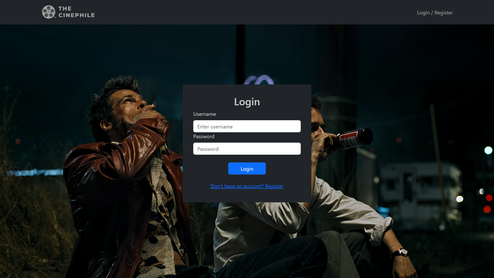
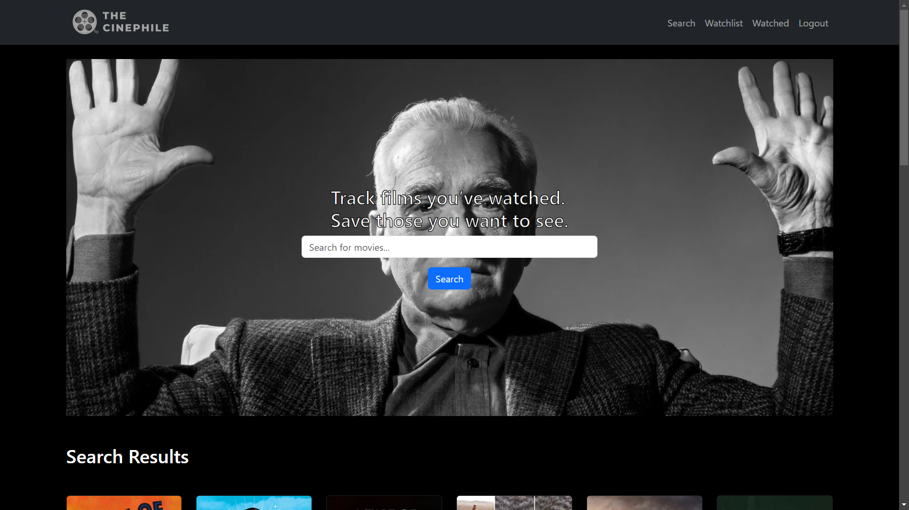
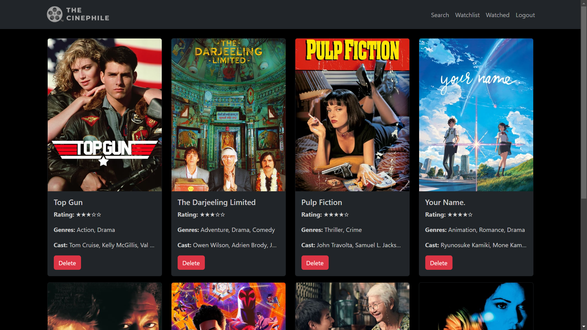

# Movie Watchlist App

This is a Movie Watchlist App built using the **MERN** stack (MongoDB, Express, React, Node.js). The app allows users to log in, view their movie watchlist, and mark movies as watched. The app is fully responsive and built with a user-friendly interface.

## Table of Contents

- [Features](#features)
- [Installation](#installation)
- [Folder Structure](#folder-structure)
- [Frontend](#frontend)
- [Backend](#backend)
- [Images](#images)
- [Contributing](#contributing)

## Features

- User Authentication (login and registration)
- View your personal movie watchlist
- Mark movies as watched
- Responsive design for mobile and desktop devices

## Installation

To run this app locally, follow these steps:

1. Clone the repository to your local machine:
   ```bash
   git clone https://github.com/yourusername/movie-watchlist.git
   ```

2. Navigate to the project directory:
   ```bash
   cd movie-watchlist
   ```

3. Install dependencies for both the client and the server:

   For the frontend (React app):
   ```bash
   cd client
   npm install
   ```

   For the backend (Node.js app):
   ```bash
   cd server
   npm install
   ```

4. Set up your environment variables. In the `/server` directory, create a `.env` file and add the following configuration:
   ```env
   MONGODB_URI=your_mongodb_connection_string
   TMDB_API_KEY=your_tmdb_api_key
   JWT_SECRET=your_jwt_secret
   ```
   In the `/client` directory, create a .env file and add the following configuration:
   ```env
   REACT_APP_BACKEND_URI=http://localhost:8080
   REACT_APP_TMDB_API=your_tmdb_api_key
   ```

5. Start the server and client:

   For the backend:
   ```bash
   cd server
   node app
   ```

   For the frontend:
   ```bash
   cd client
   npm start
   ```

Now you can open your browser and navigate to `http://localhost:3000` to see the app in action!

## Folder Structure

```
movie-watchlist/
├── client/            # Frontend code (React)
│   ├── public/        # Public assets
│   ├── src/           # Source code
│   ├── package.json   # Frontend dependencies
├── server/            # Backend code (Node.js)
│   ├── controllers/   # API controllers
│   ├── middlewares/   # Middlewares (authorization)
│   ├── models/        # MongoDB models
│   ├── routes/        # API routes
│   ├── app.js         # Entry point of the server
│   ├── package.json   # Backend dependencies
└── images/            # App screenshots
    ├── login.png      # Login page screenshot
    ├── home.png       # Home page screenshot
    └── watched.png    # Watched page screenshot
```

## Frontend

The frontend is built using **React** and is located in the `/client` folder. It communicates with the backend via API calls to provide functionality such as login, displaying the watchlist, and updating movie statuses.

### Screens:
- **Login / Register** - A page to register and log into the app with username and password.
- **Home** - A page to search movies to add to the watchlist or mark as watched.
- **Watchlist** - Shows a list of movies the user wants to watch.
- **Watched** - Shows a list of movies the user has already watched.

## Backend

The backend is built using **Node.js** and **Express** and is located in the `/server` folder. It connects to a **MongoDB** database to store user data and watchlist items.

## Images

Below are some screenshots of the app:

### Login Page



### Home Page (Watchlist)



### Watched Page



## Contributing

If you'd like to contribute to this project, please fork the repository and create a pull request. All hail open source!